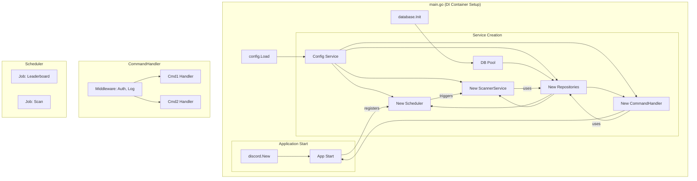

# 项目重构计划书

## 1. 引言

本文档旨在对当前 Discord Bot 项目进行一次全面的架构审查，并提出一个分阶段、可执行的重构计划。

当前项目虽然在表面上实现了一系列功能，但其底层架构存在严重缺陷。这些缺陷不仅导致了灾难性的性能问题和潜在的安全风险，还使得项目几乎无法维护和扩展。任何在现有基础上添加新功能或修复错误的尝试，都将是低效且高风险的。

本次重构的目标，是将项目从一个脆弱、混乱的“玩具”应用，转变为一个**健壮、高效、可维护、可扩展**的专业级应用程序，为未来的功能迭代和长期稳定运行奠定坚实的基础。

## 2. 核心问题诊断 (Code Audit Findings)

经过对代码库的深入审查，我们识别出以下五类核心问题：

### 2.1. 灾难性的性能问题：运行时 I/O 与数据库滥用

-   **问题描述:** 项目在处理高频操作（如命令请求）时，会反复执行高成本的磁盘 I/O 和数据库连接操作。
-   **证据:**
    -   每次调用 `/punish` 命令时，都会从磁盘重新加载并解析 `kick_config.json` ([`handlers/punish/handler.go:23`](handlers/punish/handler.go:23))。
    -   每次调用 `/rollcard` 命令时，都会创建一个新的数据库连接，而不是复用连接池 ([`handlers/rollcard/handler.go:143`](handlers/rollcard/handler.go:143))。
-   **影响:** 在并发场景下，这将迅速耗尽服务器资源，导致机器人响应极度缓慢甚至服务不可用。

### 2.2. 严重的安全隐患：SQL 注入风险

-   **问题描述:** 数据库查询语句通过原始的字符串拼接方式构建，特别是动态表名部分。
-   **证据:** 项目中大量存在类似 `... FROM "` + tableName + `"` 的代码模式 ([`utils/database/post_reader.go`](utils/database/post_reader.go))。
-   **影响:** 这是典型的 SQL 注入温床。尽管目前 `tableName` 的来源看似受控，但这种编码实践本身就是重大安全隐患。一旦任何环节允许非预期的输入影响表名，即可导致数据泄露、篡改甚至删库。

### 2.3. 不可维护的架构：上帝对象与面条式代码

-   **问题描述:** 核心组件职责不清，功能实现高度耦合，违反了基本的软件设计原则。
-   **证据:**
    -   **上帝对象 (God Object):** [`bot.Bot`](bot/bot.go:19) 结构体集成了会话、配置、数据库、所有定时器、命令处理器等几乎所有功能，是一个典型的“上帝对象”。
    -   **面条式代码 (Spaghetti Code):** [`handlers/punish/handler.go`](handlers/punish/handler.go) 和 [`handlers/rollcard/handler.go`](handlers/rollcard/handler.go) 中的处理函数极其冗长，将输入解析、配置加载、数据库读写、业务逻辑和响应构建等所有步骤杂糅在一起。
-   **影响:** 代码难以理解、调试和测试。任何微小的改动都可能引发雪崩式的连锁反应。

### 2.4. 失控的配置管理

-   **问题描述:** 配置来源分散，管理混乱，缺乏单一可信来源。
-   **证据:** 配置信息散落在环境变量、主 `config.go`、`data/kick_config.json`、`data/task_config.json` 以及按服务器 ID 存放的 `data/new_card_push_config/` 目录中。
-   **影响:** 导致“配置地狱”，排查配置问题极为困难，且容易出现不一致。

### 2.5. 僵化的模块设计与严重的代码重复

-   **问题描述:** 模块设计缺乏弹性，大量重复的“样板代码”充斥在项目中。
-   **证据:**
    -   **静态命令定义:** [`commands/builder.go`](commands/builder.go) 中所有命令被硬编码，无法根据服务器配置动态调整。
    -   **重复的权限检查:** 几乎每一个命令处理器 ([`handlers/command_handlers.go`](handlers/command_handlers.go)) 的开头都有一段几乎完全相同的权限检查代码。
-   **影响:** 极大地增加了维护成本，修改一个通用逻辑需要在多个地方同步，极易出错。

## 3. 重构蓝图与实施路线图

为了系统性地解决上述问题，我们提出以下三阶段重构计划。

### 3.1. 架构演进示意图

**重构前 (Current Architecture):**

```mermaid
graph TD
    subgraph main.go
        A[main()] --> B(config.Load)
        B --> C(database.Init)
        C --> D[bot.New(cfg, db)]
        D --> E[handlers.Register(bot)]
        E --> F[bot.Run()]
    end

    subgraph bot.Bot (God Object)
        G[Session]
        H[Config]
        I[DB Connection]
        J[Tickers * 7]
        K[Command Handlers Map]
        L[Cooldowns]
    end

    subgraph "Scattered Logic"
        M[handlers/command_handlers.go] -- reads --> H
        M -- uses --> I
        N[scanner/scan.go] -- reads --> O[task_config.json]
        N -- creates --> P[DB Connection]
        Q[bot/run.go] -- starts --> J
        Q -- starts --> N
    end

    F --> Q
    E --> M
    D -- contains --> G & H & I & J & K & L
```

**重构后 (Proposed Architecture):**



### 3.2. 实施路线图

#### **第一阶段：地基重建 (Foundation Reconstruction)**
*   **目标:** 解决核心性能、安全与数据一致性问题。
*   **任务:**
    1.  **统一配置管理:**
        *   **动作:** 引入 `Viper` 库，将所有 `.json` 配置整合进一个 `config.yaml` 文件。在程序启动时一次性加载，并通过依赖注入提供给所有模块。
        *   **收益:** 单一配置来源，消除运行时磁盘 I/O。
    2.  **建立数据库连接池:**
        *   **动作:** 在程序启动时初始化 `sql.DB` 连接池，并在整个应用生命周期内复用。
        *   **收益:** 根除性能瓶颈，提升数据库操作效率。
    3.  **引入依赖注入 (DI):**
        *   **动作:** 使用 `google/wire` 或手动方式建立 DI 容器。在 `main.go` 中统一组装所有服务及其依赖。
        *   **收益:** 模块解耦，可测试性大幅提升。
    4.  **构建数据访问层 (Repository):**
        *   **动作:** 创建 `repository` 包，为每个数据模型（Post, Punishment）实现 Repository 接口，封装所有 SQL 操作。禁止在业务逻辑中出现裸 SQL。
        *   **收益:** 业务与数据逻辑分离，杜绝 SQL 注入风险，便于维护。

#### **第二阶段：结构优化 (Structural Optimization)**
*   **目标:** 拆分复杂模块，引入现代设计模式。
*   **任务:**
    1.  **拆分上帝对象:**
        *   **动作:** 将 `bot.Bot` 的功能拆分到独立的 `SchedulerService`, `CommandHandler`, `EventListener` 等服务中。
        *   **收益:** 遵循单一职责原则，代码结构清晰。
    2.  **实现命令处理中间件:**
        *   **动作:** 引入中间件模式，将权限检查、日志记录、错误处理等横切关注点从命令处理器中剥离。
        *   **收益:** 消除代码重复，处理器只关注核心业务。

#### **第三阶段：全面净化 (Code Purification)**
*   **目标:** 消除所有剩余的“代码坏味道”，提升代码质量。
*   **任务:**
    1.  **重构 `utils` 包:** 将其中的功能移动到更合适的领域包中。
    2.  **统一日志系统:** 引入 `zerolog` 或 `zap` 等结构化日志库，将 Discord 发送作为其一个输出目标。
    3.  **代码静态分析:** 使用 `golangci-lint` 等工具对代码进行全面扫描和修复。

## 4. 预期收益

完成本次重构后，项目将获得以下核心收益：

-   **性能:** 机器人响应速度将得到数量级的提升。
-   **稳定性:** 消除资源泄露和崩溃风险，系统将更加稳定可靠。
-   **安全性:** 彻底杜绝 SQL 注入等严重安全漏洞。
-   **可维护性:** 代码结构清晰，模块化，开发者能够快速定位问题并安全地进行修改。
-   **可扩展性:** 添加新功能或命令将变得简单、低风险，开发效率大大提高。

## 5. 结论

当前项目已处于技术负债的临界点，重构是唯一正确的选择。本计划书提供了一个清晰、务实的路线图，旨在通过系统性的架构重塑，将项目转变为一个高质量、可持续发展的软件资产。建议立即批准并启动此计划。