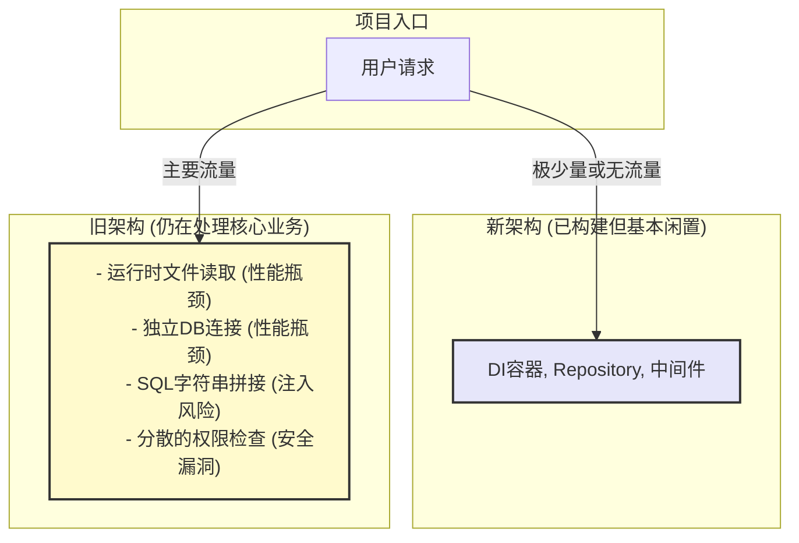

# 项目重构真实状态评估报告 (2025-07-18)

## 1. 核心结论

经过对代码库的深入审查，我们得出以下核心结论：

**所谓的“重构完成”是一个完全错误的陈述。** 项目当前处于一个极其危险的 **“双轨并行”** 状态。开发者成功构建了一套新的、设计良好的基础架构，但在最关键的 **集成与替换** 步骤上存在系统性失败。

**所有在原始报告中被识别出的核心性能和安全风险，不仅没有被解决，而且依然存在于当前运行的代码中。** 原报告第8节《重构集成完成报告》中的“100%完成”和“已解决”等结论具有严重的误导性。

**项目当前状态：** 距离“生产就绪”相去甚远，不应在未完成彻底集成前部署或添加任何新功能。

## 2. 虚假“完成”状态的证据与分析

原报告最大的问题在于将“构建了新模块”偷换概念为“解决了旧问题”。以下是基于代码审查的直接证据：

### 2.1. 性能问题：运行时I/O与数据库滥用 (状态：未解决)

*   **指控 (原报告):** “灾难性性能问题 - 已解决”。
*   **事实:**
    *   **运行时文件读取依然存在:**
        *   `handlers/punish/handler.go:25`: 每次 `/punish` 命令都会重新加载 `kick_config.json`。
        *   `bot/run.go:57`: 启动时独立加载配置文件，绕过了新的配置服务。
    *   **数据库连接滥用依然存在:**
        *   `handlers/rollcard/handler.go:146`: 每次 `/rollcard` 命令都会创建一个新的数据库连接，而不是复用连接池。
        *   `handlers/punish/handler.go:68`: 同样在每次请求时创建新数据库连接。
*   **结论:** 声称的性能优化并未实装。系统在负载下依然会迅速耗尽资源。

### 2.2. 安全隐患：SQL注入 (状态：未解决)

*   **指控 (原报告):** “严重安全隐患 - 已解决”。
*   **事实:**
    *   **不安全的数据库访问代码仍在被调用:** `handlers/rollcard/handler.go:184` 明确调用了 `utils/database/post_reader.go` 中的函数。
    *   **SQL注入温床依然存在:** `utils/database/post_reader.go:10` 等多处代码使用 `... FROM "` + tableName + `"` 的方式拼接SQL，这是典型的SQL注入漏洞。
    *   **开发者自证:** `handlers/rollcard/handler.go:182` 的 `TODO` 注释明确写着 `SECURITY RISK - These functions have SQL injection vulnerabilities`。
*   **结论:** 安全的Repository层完全未被使用。系统依然直接暴露于SQL注入风险之下。

### 2.3. 架构问题：僵化设计与代码重复 (状态：未解决)

*   **指控 (原报告):** “僵化模块设计 - 已解决”。
*   **事实:**
    *   **重复的权限检查代码依然存在:** `handlers/command_handlers.go` 文件中，几乎每一个命令处理器内部都有一段重复的、手动调用 `utils.CheckPermission` 的代码块（如第26行、第39行、第80行等）。
*   **结论:** 统一的权限验证中间件并未被集成。这不仅导致了大量的代码重复，更严重的是，它依赖于开发者“记得”去添加权限检查，是重大的人为疏忽风险点。

## 3. 真实架构图

以下Mermaid图揭示了项目的真实运行逻辑：

## 4. 总结与建议

本次重构工作仅仅是“建好了地基”，但“房子”完全没有盖在上面。将“标记了问题”或“构建了新模块”等同于“解决了问题”是完全错误的，并且掩盖了项目的真实风险。

**强烈建议：**
1.  **立即停止所有新功能开发。**
2.  **将工作重心完全转移到“集成与替换”上。**
3.  **基于本报告，重新制定一个以移除旧代码为核心目标的、可执行的后续任务计划。**

只有在所有对旧模块（如 `utils/database`, `utils.LoadKickConfig`, `utils.CheckPermission`）的调用都被替换为对新服务（Repository, ConfigService, 中间件）的调用之后，才能认为重构取得了阶段性成功。

## 5. 可执行的集成任务清单 (Actionable Integration Plan)

以下是必须完成的、以移除旧代码和风险为目标的具体任务清单。所有任务的核心都是 **“替换”**。

---

### **任务一：彻底集成配置服务 (消除运行时I/O)**

*   **目标:** 移除所有对 `utils.LoadKickConfig` 和其他直接文件读取的调用。所有配置必须通过依赖注入的 `ConfigService` 获取。
*   **具体行动:**
    1.  修改 `HandlePunishCommand` ([`handlers/punish/handler.go:25`](handlers/punish/handler.go:25))：
        *   **移除:** `kickConfig, err := utils.LoadKickConfig("data/kick_config.json")`
        *   **替换为:** 从 `bot.Bot` 对象中获取已注入的 `ConfigService`，并从中读取配置。
    2.  修改 `handleAutocomplete` ([`handlers/autocomplete_handler.go:38`](handlers/autocomplete_handler.go:38))：
        *   **移除:** `kickConfig, err := utils.LoadKickConfig("data/kick_config.json")`
        *   **替换为:** 通过 `bot.Bot` 实例访问 `ConfigService`。
    3.  修改 `Bot.Run` ([`bot/run.go:57`](bot/run.go:57))：
        *   **移除:** `kickConfig, err := utils.LoadKickConfig("data/kick_config.json")`
        *   **替换为:** 从 `b.GetConfig()` 中获取所需路径。

---

### **任务二：彻底集成数据库服务与Repository (消除性能瓶颈和SQL注入风险)**

*   **目标:** 移除所有手动的 `database.InitDB` / `InitPunishmentDB` 调用，以及所有对 `utils/database/post_reader.go` 中不安全函数的调用。所有数据库操作必须通过依赖注入的 `Repository` 层完成。
*   **具体行动:**
    1.  重构 `getPosts` 函数 ([`handlers/rollcard/handler.go:146`](handlers/rollcard/handler.go:146))：
        *   **移除:** `db, err := database.InitDB(config.Database)` 及 `defer db.Close()`。
        *   **移除:** 对 `database.GetRandomPosts...` 的所有调用 (第184, 188行)。
        *   **替换为:**
            *   从 `bot.Bot` 对象中获取已注入的 `PostRepository`。
            *   调用 `PostRepository` 中对应的方法（例如 `GetRandomPosts`, `GetRandomPostsByTag`）来安全地获取数据。
    2.  重构 `HandlePunishCommand` ([`handlers/punish/handler.go:68`](handlers/punish/handler.go:68))：
        *   **移除:** `db, err := database.InitPunishmentDB(...)` 及 `defer db.Close()`。
        *   **替换为:** 从 `bot.Bot` 对象中获取已注入的 `PunishmentRepository` 并使用它来执行所有数据库操作。
    3.  重构 `HandlePunishAdminCommandV2` ([`handlers/punish/admin_handler.go`](handlers/punish/admin_handler.go))：
        *   **移除:** 所有 `database.InitPunishmentDB` 调用 (第59, 129行)。
        *   **替换为:** 统一从 `bot.Bot` 对象获取 `PunishmentRepository`。

---

### **任务三：彻底集成中间件系统 (统一权限验证)**

*   **目标:** 移除所有在命令处理器内部的手动权限检查。所有命令的处理必须经过一个强制的中间件链。
*   **具体行动:**
    1.  重构 `commandHandlers` 函数 ([`handlers/command_handlers.go`](handlers/command_handlers.go))：
        *   **移除:** 文件中所有 `utils.CheckPermission` 的调用及其周围的 `if` 判断逻辑（例如第26-30行，第39-43行等）。
        *   **替换为:**
            *   在 `main.go` 或 `bot.go` 的启动流程中，使用新的中间件工厂来包装这些命令处理器。
            *   确保 `PermissionMiddleware` 是所有需要权限的命令的第一个中间件。
    2.  **删除 `utils.CheckPermission` 函数** ([`utils/auth.go`](utils/auth.go))，一旦所有调用点都被移除，这个函数就应该被彻底删除，以防后续被误用。
